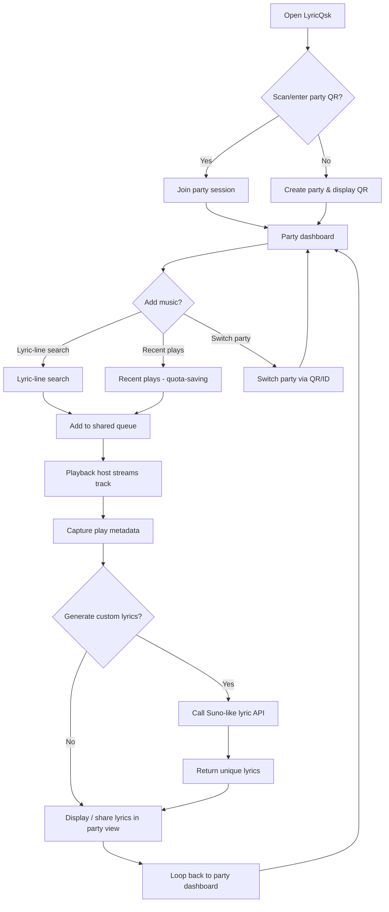

# LyricQsk App Workflow

This document explains how LyricQsk works end-to-end, including startup, feature flows, data flow, and where each part lives in code.

## 1. High-level architecture

LyricQsk is a Flutter app with two primary runtime modes:

- Mobile (`kIsWeb == false`): lyric-based playback + party host/guest flow with lyrics generation.
- Web (`kIsWeb == true`): shared queue host/guest UI in browser.

Core external systems:

- Firebase Realtime Database: shared party queue (`parties/{partyId}/queue`).
- YouTube Data API: song search metadata.
- LRCLIB: lyric-line to song/timestamp resolution (mobile lyric play).
- Suno-like Lyric API: custom lyric generation for tracks.
- SharedPreferences: local recents/profile cache.

## 2. Entry and bootstrap flow

### App startup

1. `lib/main.dart`
2. `WidgetsFlutterBinding.ensureInitialized()`
3. Firebase app named `MongoBox` is initialized (if not already initialized)
4. `MyApp` is launched

### QR/Party decision

In `MyApp.home`:

- User scans or enters party QR/ID:
  - Routes to `JoinPartyScreen` (guest mode)
- User creates new party:
  - Routes to `HostPartyScreen` (host mode)
- Web: `HomeScreen` (from `lib/screens/web/home_screen_web.dart` via conditional import)
- Mobile: `MobileLyricApp` -> `LyricHomeScreen` or host/join screens based on intent

## 3. Core runtime flows

## 4. Mobile flow details

## 4.1 Party Dashboard

File: `lib/screens/host_party_screen.dart` / `lib/screens/join_party_screen.dart`

### What user does

- After joining/creating party, enters party dashboard.
- Dashboard shows:
  - Party ID and share QR
  - Shared music queue
  - Currently playing track
  - Add music options

### What code does

1. Initializes `SharedQueueService(partyId)`.
2. Subscribes to `streamQueue()` for real-time updates from Firebase.
3. Displays party metadata and options to add music.

## 4.2 Add Music Flow

### User options

1. **Lyric-line search**: Enter or dictate a lyric line to find song
2. **Recent plays**: Query-saving option to re-add recently played tracks
3. **Switch party**: Change to a different party using QR/ID

Each option leads to adding the selected track to the shared queue.

### Lyric-line search

File: `lib/services/playback_service_mobile.dart`

1. Calls `PlaybackServiceMobile.resolveCandidates(query)`.
2. `PlaybackServiceMobile`:
   - Searches LRCLIB across multiple query variants.
   - Hydrates lyric candidates (`getById`) when synced lyrics are missing.
   - Computes best timestamp match for the lyric line.
   - Searches YouTube via `YoutubeMobileService`.
   - Filters short/reel-style videos.
   - Ranks and merges lyric-derived + YouTube-derived candidates.
3. Selected candidate returns `videoId`, `startTimeSeconds`, `trackName`, `artistName`.
4. Track is added to shared queue.

### Recent plays (quota-saving)

File: `lib/services/local_suggestions_service.dart`

- Uses `LocalSuggestionsService` to retrieve recent tracks.
- Avoids unnecessary API calls by recommending previously played songs.
- User can quickly re-add favorite tracks with one tap.

### Voice input path

- Uses `speech_to_text` in lyrics search.
- On final speech result, recognized text populates search field.

## 4.3 Playback and Metadata

File: `lib/screens/host_party_screen.dart`

### Playback flow

1. If queue has items, first item is auto-loaded into YouTube player.
2. `YoutubePlayerController.load(...)` plays the track from start time.
3. Metadata (track ID, artist, timestamp) is captured while playing.
4. When track finishes or user skips, next queue item auto-loads.

### Metadata capture

(Currently in-progress feature)

Records for each played track:
- YouTube video ID
- Track name and artist
- Play duration and completion status
- Playback timestamp within party session
- Used for lyrics generation input

## 4.4 Lyrics Generation

File: `lib/services/lyrics_service.dart` (to be enhanced)

### User decision

After track completes playback, user can opt-in to generate custom lyrics.

### Generation flow

1. If user selects "Generate custom lyrics":
   - Collects metadata from playback (track name, artist, duration)
   - Calls free Suno-like lyric API with track metadata
2. API returns unique, custom lyrics for the track
3. Lyrics are returned and displayed in party view
4. Shared with all party members
5. User can loop back to "Add music?" to continue session

## 5. Web flow details

## 5.1 Flutter web home screen

File: `lib/screens/web/home_screen_web.dart`

### Mode split

- If URL contains `partyId`, behaves as guest view for that party.
- Otherwise creates a new party ID and behaves as host.

### Capabilities

- Real-time queue sync via `SharedQueueService`.
- YouTube search and add to queue.
- Embedded playback using an HTML iframe.
- QR dialog with shareable join link.

## 5.2 Hosted join page (`join-queue.html`)

Files:

- `web/join-queue.html` (Firebase hosting target)
- `join-queue.html` (older/local variant)

Production behavior (`web/join-queue.html`):

1. Reads `partyId` from URL.
2. Initializes Firebase JS SDK.
3. Searches YouTube Data API.
4. Pushes selected songs to `parties/{partyId}/queue`.
5. Host apps (mobile/web) receive updates live via Realtime Database stream.

Hosting routes are configured in `firebase.json` so `/join-queue.html` serves this page.

## 6. Service-by-service responsibilities

### `SharedQueueService` (`lib/services/shared_queue_service.dart`)

- Single source of truth for shared queue in Firebase.
- Party-scoped path: `parties/{partyId}/queue`.
- APIs:
  - `streamQueue()`
  - `addSong(...)`
  - `remove(key)`
  - `clear()`
- Caches instances per `partyId` to reuse service objects.

### `YoutubeMobileService` (`lib/services/youtube_mobile_service.dart`)

- YouTube search wrapper for mobile screens.
- Adds filtering for short-form/non-song results.
- Fetches durations from `videos` endpoint for better filtering.
- Caches query results.

### `LyricsService` (`lib/services/lyrics_service.dart`)

- LRCLIB client (`/api/search`, `/api/get/{id}`).
- Computes text similarity and best timed lyric line match.
- Converts matched lyric entry to playable start timestamp.
- (Enhanced feature): Calls Suno-like lyric API for custom lyrics generation.

### `PlaybackServiceMobile` (`lib/services/playback_service_mobile.dart`)

- Orchestrator from lyric input -> ranked playable options.
- Merges LRCLIB-informed and YouTube fallback candidates.
- Applies confidence scoring and start-time preroll.

### `LocalSuggestionsService` (`lib/services/local_suggestions_service.dart`)

- Persists local recent lines/tracks/searches using SharedPreferences.
- Drives suggestion chips/history in search screens.
- Enables quota-saving "Recent plays" feature.

## 7. Data model and storage

### Firebase Realtime Database

Path:

- `parties/{partyId}/queue/{pushKey}`

Song fields (typical):

- `id` (YouTube video ID)
- `title`
- `artist`
- `thumbnail`
- `addedAt` (timestamp)
- `metadata` (optional: duration, lyrics)

### Local storage (SharedPreferences)

- Lyric recents/searches/tracks (`LocalSuggestionsService`)
- Guest profile (`GuestProfileService`, currently optional flow)
- Legacy local queue (`LocalQueueService`, not in active main flow)

## 8. Screen map

Active main screens:

- `HostPartyScreen` (party host dashboard)
- `JoinPartyScreen` (party guest dashboard)
- `web/HomeScreen` (Flutter web)

Available supporting screens:

- `JoinViaLinkScreen` (link parsing to join)
- `LyricHomeScreen` (standalone lyric search, legacy entry point)
- `GuestInfoScreen`
- `LoginScreen` (sign-in removed)
- `SuggestSongScreen` in `QR_landing_page.dart` (standalone/legacy)

## 9. End-to-end example (host + guest)

1. Host opens app and taps "Create party".
2. App creates `party_...` and displays QR code.
3. App starts streaming Firebase queue.
4. Host shares link/QR with `partyId` in query string.
5. Guest scans QR or enters party ID.
6. Guest searches lyric line or selects recent play and taps "Add".
7. Song is pushed to `parties/{partyId}/queue`.
8. Host queue updates instantly from `streamQueue()`.
9. Host playback points at first queue item.
10. Song plays; metadata is captured.
11. After playback, user optionally generates custom lyrics.
12. Lyrics are displayed and shared in party view.
13. Host/guest can continue adding songs or switch parties.

## 10. Operational notes

- Firebase app name is fixed as `MongoBox`; all queue operations depend on this initialization in `main.dart`.
- Web and mobile share the same Realtime Database queue path and YouTube API key pattern.
- Logs are verbose by design (debug-heavy) across host/guest and queue services.
- Lyrics generation is quota-conscious; recent plays feature reduced API calls.
- Party switching allows seamless transition between multiple active sessions.

