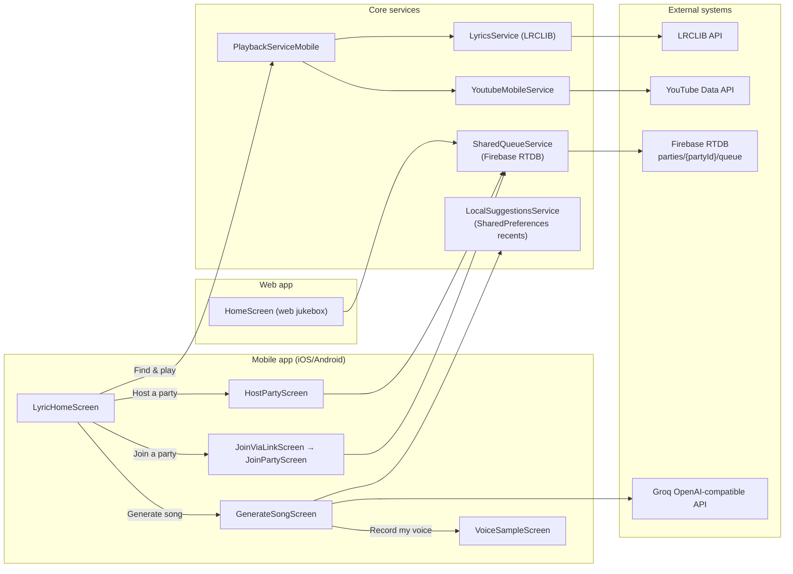

# SVJ Flow (Song / Voice / Jukebox)

This document describes the "SVJ" flows in MongoBox and how the major files interact:

- **S (Song):** AI lyric generation from your recent listening history
- **V (Voice):** recording a local voice sample (optionally used for voice generation)
- **J (Jukebox):** party queue + YouTube playback across mobile and web

The common entry point on mobile is `LyricHomeScreen` (`lib/screens/lyric_home_screen.dart`).

## 1. System map

## 2. S: Generate Song

Files:

- UI: `lib/screens/ generate_song_screen.dart`
- Recents: `lib/services/local_suggestions_service.dart`

Behavior:

1. Loads local `RecentTrack` history from `LocalSuggestionsService`.
2. Uses `GROQ_API_KEY` to call Groq’s OpenAI-compatible endpoint:
   - Suggests a mood and language
   - Generates a JSON payload with `{title, lyrics, mood, genre, language}`
3. Shows the result card and allows copying.
4. Optionally routes to the Voice flow (recording a voice sample).

## 3. V: Voice sample (local)

Files:

- UI: `lib/screens/voice_sample_screen.dart`

Behavior:

1. Requests microphone permission.
2. Records a short `m4a` to a temporary file via `record`.
3. Plays it back locally via `just_audio`.
4. The recording screen does not make network calls.

Optional/experimental:

- `lib/screens/voice_song_screen.dart` and `voice-backend/` implement a server-based voice generation flow, but the "post-record" step is currently not invoked from the recording UI.

## 4. J: Party Jukebox (shared queue)

The queue is shared between:

- Mobile host (`HostPartyScreen`)
- Mobile guest (`JoinPartyScreen`)
- Web jukebox (`HomeScreen` on web)

Files:

- Firebase queue service: `lib/services/shared_queue_service.dart`
- Mobile host UI: `lib/screens/host_party_screen.dart`
- Mobile guest UI: `lib/screens/join_party_screen.dart`
- Join-by-link + QR scanning: `lib/screens/join_via_link_screen.dart`
- Web jukebox UI: `lib/screens/web/home_screen_web.dart`

Behavior:

1. A party is identified by `partyId`.
2. `SharedQueueService(partyId)` reads/writes `parties/<partyId>/queue` in Firebase RTDB.
3. The host (mobile/web) listens to the queue stream and plays the first item.
4. Guests search YouTube and push songs into the shared queue.

## 5. Shared glue (why flows feel connected)

- `LocalSuggestionsService` is used by:
  - `LyricHomeScreen` (recents and cache seeds)
  - `GenerateSongScreen` (AI inputs)
- `SharedQueueService` is the single shared state surface for party playback.
